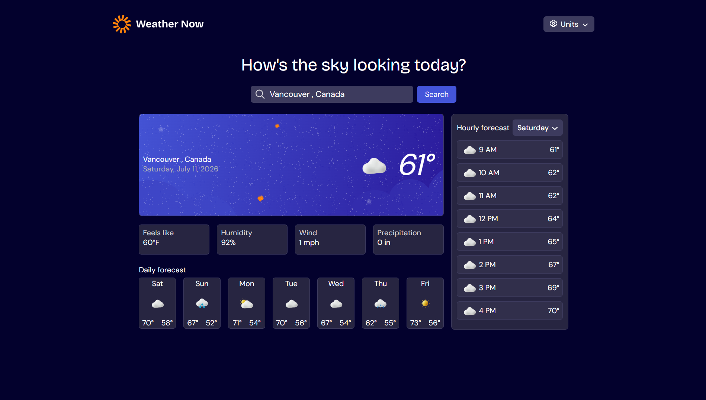

# Mentor Frontend -Solution d'application météo

Il s'agit d'une solution au [Weather App Challenge on Frontend Mentor](https://www.frontendmentor.io/challenges/weather-app-K1FhddVm49). Les défis Frontend Mentor vous aident à améliorer vos compétences en codage en construisant des projets réalistes. 

## Table des matières

-[Aperçu](#aperçu)
  -[Le défi](#le-défi)
  -[Capture d'écran](#capture d'écran)
  -[Liens](#liens)
-[Mon processus](#mon-processus)
  -[Construit avec](#construit-avec)
-[Ce que j'ai appris](#ce que j'ai appris)
-[Développement continu](#continued-development)
  -[Ressources utiles](#ressources-utiles)
  -[AI collaboration](#ai-collaboration)
-[Auteur](#auteur)
-[Remerciements](#remerciements)

## Aperçu

Application météo développé avec React.

### Le défi

Le défi est de créer une application météo capable de remplir les fonctions suivantes :

-Rechercher des informations météorologiques en entrant un emplacement dans la barre de recherche
-Afficher les conditions météorologiques actuelles, y compris la température, l'icône météo et les détails de l'emplacement
-Affichez des mesures météorologiques supplémentaires telles que la température, le pourcentage d'humidité, la vitesse du vent et les quantités de précipitations.
-Parcourir une prévision météorologique sur 7 jours avec des températures quotidiennes hautes/basses et des icônes météo
-Afficher une prévision horaire montrant les changements de température tout au long de la journée
-Basculez entre les différents jours de la semaine à l'aide du sélecteur de jour dans la section des prévisions horaires
-Basculez entre les unités de mesure impériales et métriques via la liste déroulante des unités
-Basculez entre des unités de température spécifiques (Celsius et Fahrenheit) et des unités de mesure pour la vitesse du vent (km/h et mph) et les précipitations (millimètres) via la liste déroulante des unités.
-Afficher la disposition optimale de l'interface en fonction de la taille de l'écran de leur appareil
-Voir les états de survol et de focus pour tous les éléments interactifs de la page

### Capture d'écran



### Liens
-URL de la solution : [GitHub](https://github.com/Harena-debug/Weather-App)
-URL du site en direct : [Démo en direct](https://harena-debug.github.io/Weather-App/)

## Mon processus

### Construit avec

J'ai réalisé ce projet avec les outils suivants :

-Marquage sémantique HTML5
-Variables CSS
-Boîte flexible CSS
-Grille CSS
-Flux de travail axé sur le mobile
-React JS

### Ce que j'ai appris
J'ai appris plusieurs concepts importants dans ce projet, en voici quelques-uns :

- Gérer les composants avec React

```jsx
import Header from './components/Header'
import Title from './components/title'
import SearchBar from './components/SearchBar'
import { searchCity , getWeatherMain} from './datas/data'
import MainMeteo from './components/MainMeteo'
import Position from './components/Position'
import WeatherDaily from './components/WeatherDaily'
import WeatherHourly from './components/WeatherHourly'
import Error from './components/Error'
```
- Utilisation des states React

```jsx
  const [city , setCity] = useState(null)
  const [cityList , setCityList] = useState([])
  const [isLoading , setIsLoading] = useState(false);
  const [unit , setUnit] = useState('Metric');
  const [error , setError] = useState(false)
```
- Utilisation de UseEffect React :

```jsx
    useEffect(() => {
        if(!city) return;
        const dataDaily = async () => {
            try{
                const data = await getWeatherDaily(city.latitude , city.longitude);
                setTemperatureMax(data?.daily?.temperature_2m_max ?? []);
                setTemperatureMin(data?.daily?.temperature_2m_min ?? []);
                setDate(data?.daily?.time ?? []);
                setWeatherCode(data?.daily?.weather_code ?? []);
            }
            catch(error){
                console.error(error.message);
            }
        }
        dataDaily();

        const idInterval = setInterval(() => {
            dataDaily()
        } , 60000);

        return (() => clearInterval(idInterval));
    } , [city]);
```

### Développement continu

Dans les projets futurs, j'envisagerai de commencer à apprendre le Tailwind CSS pour faciliter mon parcours de développement.

### Ressources utiles

-[Open Classroom](https://openclassrooms.com/fr/courses/8710331-debutez-avec-react) - Ma ressource de départ pour commencer le React
-[W3 Schools](https://www.w3schools.com/) - Ma ressource pour bien consolider chaque concept

### Collaboration IA

J'ai collaboré avec les IA de la manière suivante : 

-J'ai utilisé Chatgpt et Claude AI dans ce projet
-Je les ai utilisés principalement pour des revues de code, des petites corrections au cas où il y en aurait

## Auteur

-Site Web -[Harena](https://github.com/Harena-debug)
-Mentor Frontend -[@Harena-debug](https://www.frontendmentor.io/profile/Harena-debug)

## Remerciements

Merci vraiment à Frontend Mentor de m'avoir proposé ce défi même si cela n'a pas été facile, merci également à l'IA de m'avoir aidé durant ce voyage, merci également au Seigneur de m'avoir soutenu durant ce projet.